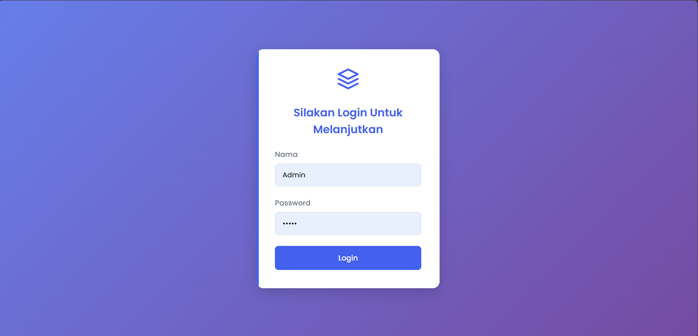
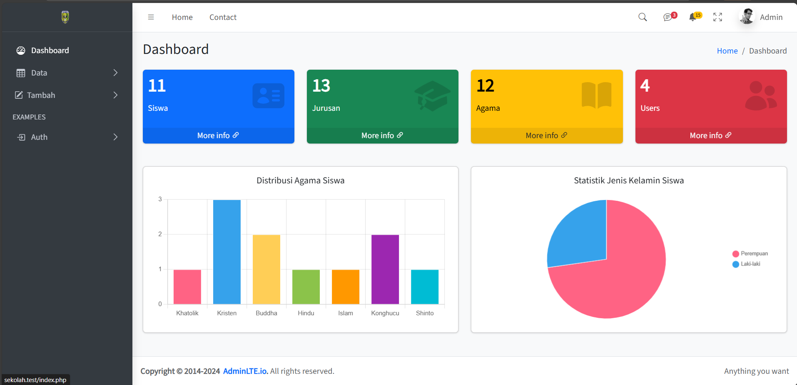

# 📘 Aplikasi Manajemen Data Siswa

Aplikasi berbasis web untuk mengelola data siswa, jurusan, agama, dan pengguna. Dilengkapi sistem login, dashboard, dan fitur CRUD yang mudah digunakan.

---

## 🔐 Login

Halaman login digunakan untuk mengautentikasi pengguna sebelum mengakses sistem.

---

## 📊 Dashboard & Data

### 🏠 Dashboard
Tampilan awal setelah login, menampilkan ringkasan data dan navigasi utama.

### 📋 Data Siswa
Menampilkan daftar lengkap siswa dengan fitur pencarian, edit, dan hapus data.

### 🏫 Data Jurusan
Menyimpan dan mengelola informasi jurusan pendidikan.

### 🧎 Data Agama
Digunakan untuk mengelola pilihan agama yang tersedia dalam input data siswa.

### 👥 Data Users
Menampilkan daftar pengguna yang memiliki akses ke sistem.

### 🙍‍♂️ Profil
Menampilkan data pengguna yang sedang login, termasuk opsi untuk edit profil.

---

## ➕ Tambah Data

Formulir untuk menambahkan data baru ke dalam sistem.

### ➕ Tambah Siswa  

### ➕ Tambah Jurusan  

### ➕ Tambah Agama  

### ➕ Tambah Users  

---

## 🗄️ Rancangan Database

Struktur tabel pada database untuk mendukung sistem aplikasi.

### 📑 Tabel Login  

### 📑 Tabel Siswa  

### 📑 Tabel Users  

### 📑 Tabel Jurusan  

### 📑 Tabel Agama  

> ⚠️ Periksa kembali nama file gambar seperti `databse agama.png`, pastikan tidak ada kesalahan penulisan seperti typo ("databse" seharusnya "database").

---

## ⚙️ Teknologi yang Digunakan

- HTML, CSS, JavaScript
- PHP / Laravel / CodeIgniter (sesuaikan dengan proyek)
- MySQL / Firebase
- AdminLTE (untuk antarmuka)

---

## 🧑‍💻 Pengembang

- [Muhammad Fil Ardh Athallah] — Developer Aplikasi

---

## 📃 Lisensi

Proyek ini adalah tugas sekolah.

---

## 📥 Cara Menjalankan

1. Clone repository ini
2. Import file database ke phpMyAdmin
3. Sesuaikan konfigurasi koneksi database
4. Jalankan server lokal dengan XAMPP / Laragon / php artisan serve (jika Laravel)
